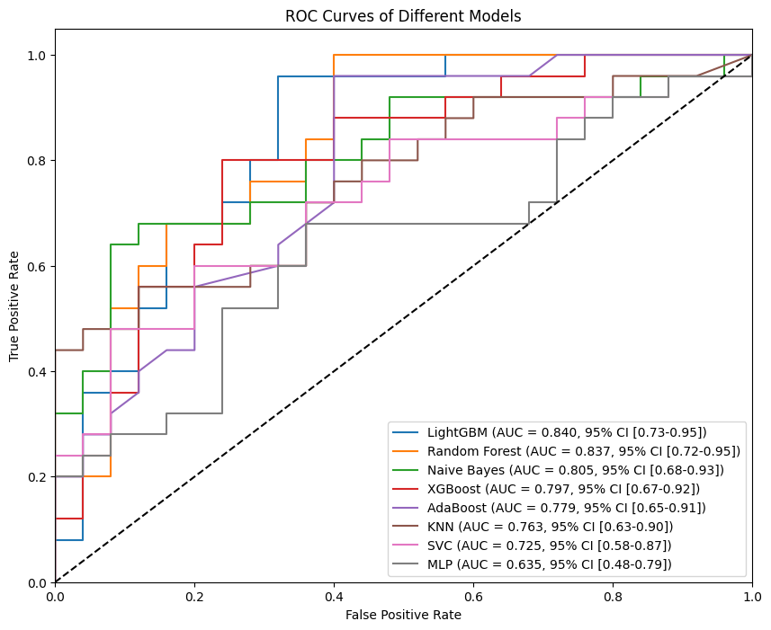
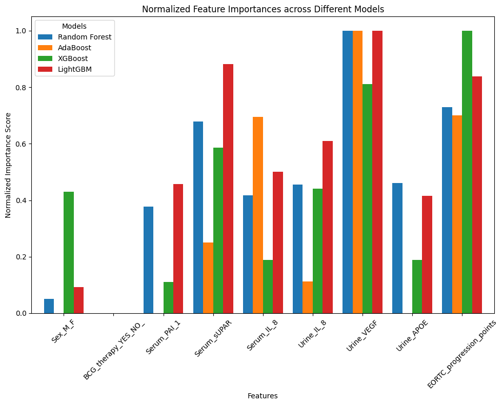

# Project Title

__One Paragraph+__ describing the project goes here. For example: This is a README template you would use to describe a scientific or data analysis project. Provide an overview of the goals of the project, how data was obtained, and other important details others or you in 6 months should be aware of.

## Interactive Version

Click on the button below to run the repository in the binder. It may take a couple of minutes. 

[](https://mybinder.org/v2/gh/FilipKubackiEmoLink/Biomarkers-of-Recurrence-and-Progression-in-Non-muscle-Invasive-Bladder-Cancer/HEAD)

## Data

Training dataset was over-sampled using the [SMOTE](https://imbalanced-learn.org/stable/references/generated/imblearn.over_sampling.SMOTE.html) to coutermeasure the data imbalance.

__Data Contact__

List a data contact that can be contacted for inqueries regarding archiving and/or removal of data. Two methods of contact should be left, including one that is outside / external to the current institution.

* **Daniel E. Cook <danielecook@gmail.com>** - Contact for inqueries regarding data located in `primary/data/folder`.
* __Expiration Date__ -  YYYYMMDD - Data can be (deleted | archived) <-- choose one

Most scripts / analysis can be left as they often do not take up substantial amounts of space, so it is important to describe in detail how data should be handled.

## Getting Started

To run the ***Analyses.ipynb*** you need to first configure the environment
```
pip install -r requirements.txt
```

### Recomendation

Create the python virtual environment before configuring the environment. [See the official documentation](https://packaging.python.org/en/latest/guides/installing-using-pip-and-virtual-environments/)

```python
python3 -m venv ./venv # install virtual env.
source venv/bin/activate # activate virtrual env.
```

## Publications

List references with links to publications this analysis was used for.

 __The genetic basis of natural variation in Caenorhabditis elegans telomere length__<br />
Cook DE, Zdraljevic S, Tanny RE, Seo B, Riccardi DD, Noble LM, Rockman MV, Alkema MJ, Braendle C, Kammenga JE, Wang J, Kruglyak L, Fe ́ lix MA, Lee J, Andersen EC. <br />
2016. Genetics 204:371–383. DOI: https://doi.org/10.1534/genetics.116. 191148, PMID: 27449056

## Training Results


<br /> Figure 1: A visualization summarizing the randomized search on hyper parameters for multipel models.


<br /> Figure 2: A visualization summarizing the normalized feature imprtance of the models holding such information.

## Contributing

Details regarding how to contribute. Coding style conventions, use of tests, etc.

## Notes

Additional notes / precatuions / etc. to make users aware of.

## Authors

List all authors, their contributions, and how to contact; Preferably an internal and external form of contact.

* **Daniel E. Cook** - *Initial work* - [danielecook](https://github.com/danielecook); danielecook@gmail.com

## License

This project is licensed under the MIT License - see the [LICENSE.md](LICENSE.md) file for details

## Acknowledgments

* Hat tip to anyone whose code was used
* Inspiration
* etc